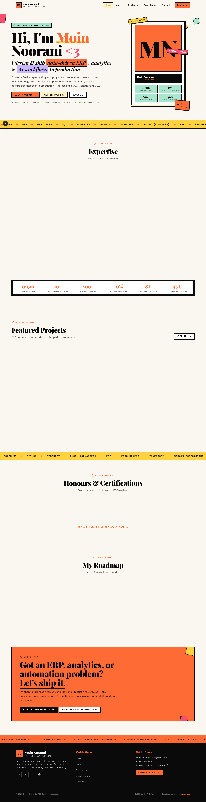
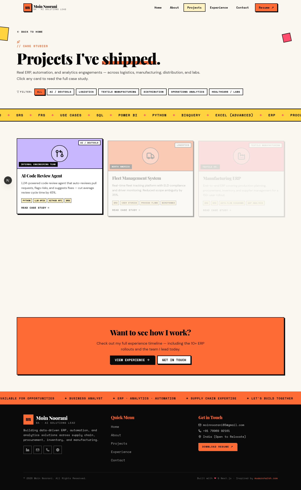
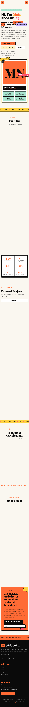

# Moin Noorani — Portfolio

> Neo-brutalist portfolio for **Moin Noorani**, Business Analyst & AI Solutions Lead.
> Built with Next.js 16, TypeScript, Tailwind CSS 4, and Framer Motion.

<p align="center">
  
</p>

<p align="center">
  <a href="https://github.com/Moinnoorani/portfolio/blob/main/LICENSE">
    
  </a>
  
  
  
  
</p>

---

## ✨ Overview

A bold, neo-brutalist personal portfolio inspired by [muaazshaikh.com](https://www.muaazshaikh.com/) — built for a Business Analyst working across ERP, supply chain, automation, and AI workflows. Every section is clickable and routes via URL search params (`?view=projects`, `?view=project&id=...`) for shareable links, with smooth Framer Motion transitions and a fully responsive mobile experience.

The experience duration on the site is **computed dynamically** from October 2024 to the current date, so it always reflects the actual tenure without manual edits.

<p align="center">
  
</p>

## 🎨 Design

| Token              | Value                                              |
| ------------------ | -------------------------------------------------- |
| **Style**          | Neo-brutalist — thick borders, offset shadows      |
| **Palette**        | Orange `#FF6B35` · Coral `#FF4D6D` · Yellow `#FFD23F` · Mint `#A8E6CF` · Lilac `#C8B6FF` |
| **Display font**   | Playfair Display (900, italic)                     |
| **Mono font**      | Space Mono (400, 700)                              |
| **Body font**      | DM Sans (400–700)                                  |
| **Background**     | `#FAF7F0` (warm paper)                             |

## 🧱 Tech Stack

- **[Next.js 16](https://nextjs.org/)** — App Router, Turbopack
- **[TypeScript 5](https://www.typescriptlang.org/)** — strict typing throughout
- **[Tailwind CSS 4](https://tailwindcss.com/)** — utility-first styling with custom brutal design tokens
- **[Framer Motion 12](https://www.framer.com/motion/)** — scroll-triggered and view-transition animations
- **[Lucide Icons](https://lucide.dev/)** — consistent icon set across all views
- **[shadcn/ui](https://ui.shadcn.com/)** — accessible primitives (button, dialog, etc.)

## 📂 Structure

```
src/
├── app/
│   ├── globals.css           # Brutal design tokens, animations, primitives
│   ├── layout.tsx            # Root layout with font loading
│   └── page.tsx              # View router (Suspense-wrapped)
├── components/
│   ├── portfolio/
│   │   ├── navbar.tsx              # Sticky nav with mobile drawer
│   │   ├── footer.tsx              # Footer + marquee strip
│   │   ├── marquee.tsx             # Reusable scrolling tags strip
│   │   ├── home-view.tsx           # Hero + expertise + projects + roadmap + CTA
│   │   ├── about-view.tsx          # Bio + skills + education + certifications
│   │   ├── projects-view.tsx       # Filterable projects grid
│   │   ├── project-detail-view.tsx # Full case study page with sidebar
│   │   ├── experience-view.tsx     # Alternating timeline
│   │   ├── contact-view.tsx        # Form + contact cards
│   │   ├── use-view-nav.ts         # URL-search-param navigation hook
│   │   └── use-experience.ts       # Dynamic experience duration hook
│   └── ui/                          # shadcn/ui components
└── lib/
    ├── portfolio-data.ts     # Single source of truth for all content
    ├── icon-map.tsx          # Icon key → Lucide component mapping
    └── accents.ts            # Accent color helpers
```

## 📈 Analytics & SEO

### Google Analytics 4 (GA4)
The site is wired up for GA4. To activate:

1. Go to https://analytics.google.com → **Admin → Create account**
2. Property name: `Moin Noorani Portfolio`
3. Add a **Web stream** → URL: your Vercel domain
4. Copy the **Measurement ID** (looks like `G-XXXXXXXXXX`)
5. In Vercel → Settings → Environment Variables, add:
   ```
   NEXT_PUBLIC_GA_MEASUREMENT_ID = G-XXXXXXXXXX
   ```
6. Redeploy. Data starts flowing within ~5 minutes.

Until the ID is set, no analytics scripts load (privacy-friendly default).

### SEO essentials (already built in)
- **`/sitemap.xml`** — dynamic, auto-includes all views + every project case study
- **`/robots.txt`** — allows all crawlers, points to sitemap
- **JSON-LD Person schema** — structured data with name, job title, skills, credentials, projects, social profiles (validates at https://search.google.com/test/rich-results)
- **Open Graph tags** — title, description, 1200×630 OG image, site name, locale
- **Twitter Card** — `summary_large_image` with OG image
- **Canonical URL** — set via `metadataBase` (override with `NEXT_PUBLIC_SITE_URL` env var)
- **Robots meta** — `index, follow` with `max-image-preview: large`
- **OG image** — auto-generated branded brutal image at `/og-image.png` (regenerate with `bun run scripts/gen-og-image.ts`)

### Google Search Console verification
1. Go to https://search.google.com/search-console
2. Add property → **URL prefix** → your site URL
3. Choose **HTML tag** verification method
4. Copy the `content="..."` value from the meta tag they show you
5. In Vercel → Settings → Environment Variables, add:
   ```
   NEXT_PUBLIC_GOOGLE_SITE_VERIFICATION = <paste-the-content-value>
   ```
6. Redeploy → click "Verify" in Search Console

### Custom domain SEO
When you connect a custom domain (e.g. `moinnoorani.online`):
1. Add the domain in Vercel → Settings → Domains
2. Update `NEXT_PUBLIC_SITE_URL` env var to `https://moinnoorani.online`
3. Redeploy — sitemap, robots, canonical URLs, and OG tags all update automatically
4. Re-submit the sitemap in Google Search Console (it'll be at `https://moinnoorani.online/sitemap.xml`)

## 🚀 Features

### 7 fully-navigable views
- **Home** — hero with profile card, expertise grid, featured projects, stats, honours, testimonial, latest posts, roadmap, contact CTA
- **About** — bio with dynamic experience duration, skill toolbox (BA / Supply Chain / Tools / AI Stack), education, all certifications
- **Projects** — filterable grid of 10 case studies by domain
- **Project Detail** — full case study with overview, highlights, deliverables, tools sidebar, and "Next case study" navigation chain
- **Writing** — curated LinkedIn tech posts with category filter (Business Analysis, AI Industry, Agents, Engineering, Process)
- **Experience** — alternating timeline of 2 roles + education
- **Contact** — working form (Web3Forms integration) + direct contact cards + resume download

### Contact form — actually sends emails
The contact form is wired up with [Web3Forms](https://web3forms.com) — no backend code needed.

**To enable real email delivery (2-minute setup):**
1. Go to https://web3forms.com → enter your email → they mail you a free access key
2. In your Vercel project → Settings → Environment Variables, add:
   ```
   NEXT_PUBLIC_WEB3FORMS_KEY = <your-access-key>
   ```
3. Redeploy. Submissions will now land in your inbox.

Until the key is set, the form runs in **demo mode** — it simulates success and shows setup instructions on the contact page.

### Content highlights
- **10 case studies**: AI Code Review Agent, Fleet Management System, Manufacturing ERP, Channel Management ERP, AI Workflow Automation, Lab Management System, AI Workflow Automation Suite, AI Content & Deck Generation Pipeline, Autonomous AI Agents Evaluation, Global Client Engagement (Pre-sales)
- **Testimonial** from Makhdum Chamadiya (CEO & CTO, Codes Technology) on the home page
- **Writing section** with 6 curated LinkedIn posts (Business Analysis, AI Industry, Agents, Engineering categories) — only tech posts shown, non-tech/hiring posts excluded by design
- **Dynamic experience** — computed from `careerStartDate` (Oct 2024) every page load, hydration-safe
- **Resume PDF** — bundled in `/public` and linked from navbar, footer, and contact page

### Interaction details
- Shareable URLs via `?view=` and `?id=` search params
- Sticky navbar that gains a background on scroll
- Mobile hamburger menu with full nav
- Scroll-triggered Framer Motion reveals
- Custom brutal scrollbar styling
- Hover effects on every interactive element (offset shadow shift)
- Fully keyboard accessible with ARIA labels

## 🖥️ Local Development

```bash
# 1. Clone
git clone https://github.com/Moinnoorani/portfolio.git
cd portfolio

# 2. Install dependencies (Bun recommended; npm/pnpm/yarn also work)
bun install

# 3. Start the dev server
bun run dev

# 4. Open
# → http://localhost:3000
```

### Available scripts

| Command            | Description                          |
| ------------------ | ------------------------------------ |
| `bun run dev`      | Start dev server on port 3000        |
| `bun run build`    | Production build                     |
| `bun run start`    | Run production build                 |
| `bun run lint`     | ESLint (Next.js + React rules)       |

## ☁️ Deploy

This is a standard Next.js 16 app — deploys in ~60 seconds on Vercel.

[](https://vercel.com/new/clone?repository-url=https://github.com/Moinnoorani/portfolio)

1. Click the button above (or go to [vercel.com/new](https://vercel.com/new))
2. Import the `Moinnoorani/portfolio` repo
3. Click **Deploy** — zero config needed, Vercel auto-detects Next.js
4. Live at `portfolio-moinnoorani.vercel.app` (or your custom domain)

## 📱 Responsive

<p align="center">
  
</p>

Mobile-first design with breakpoints at `sm` (640px), `md` (768px), `lg` (1024px), and `xl` (1280px). The navbar collapses to a hamburger menu under 768px, and all grids reflow to single-column.

## 📝 Customizing

All content lives in **`src/lib/portfolio-data.ts`** — a single TypeScript file that's the source of truth for:

- Personal info (name, role, contact, location)
- `careerStartDate` (change this to update the dynamic experience duration)
- Projects (slug, icon, domain, highlights, impact, tools, deliverables)
- Experience (roles, periods, bullets)
- Skills, certifications, roadmap, stats, quick facts
- Marquee tags
- Expertise areas

To add a new project: add an entry to the `projects` array, pick an icon key from `ProjectIcon` type, and it automatically shows up in the Projects grid + Home featured section.

## 📄 License

MIT © Moin Noorani

## 🔗 Links

- **GitHub**: [@Moinnoorani](https://github.com/Moinnoorani)
- **LinkedIn**: [in/moinnoorani](https://linkedin.com/in/moinnoorani)
- **Email**: [moinnoorani85@gmail.com](mailto:moinnoorani85@gmail.com)
- **Portfolio**: [moinnoorani.netlify.app](https://moinnoorani.netlify.app)

---

<p align="center">
  Built with <span style="color: #FF4D6D;">❤</span> & Next.js · Inspired by <a href="https://www.muaazshaikh.com/">muaazshaikh.com</a>
</p>
